# MyOrderBook — Class Diagram

Render this in any Mermaid-compatible viewer:
- **VS Code** — install the "Markdown Preview Mermaid Support" extension, then open preview
- **GitHub** — renders automatically in `.md` files
- **Online** — paste into https://mermaid.live

```mermaid
classDiagram

%% ─────────────────────────────────────────────────────────────────────────────
%%  PRIMITIVE TYPE ALIASES  (defined in types.h)
%%  Shown here for reference — not real classes, just named integers.
%%
%%  OrderId       = uint64_t
%%  SequenceNumber= uint64_t
%%  Price         = int64_t
%%  Quantity      = int64_t
%%  TradeId       = uint64_t
%% ─────────────────────────────────────────────────────────────────────────────


%% ── Enumerations ─────────────────────────────────────────────────────────────

    class Side {
        <<enumeration>>
        Buy
        Sell
    }

    class TimeInForce {
        <<enumeration>>
        GoodTillCancel
        ImmediateOrCancel
        FillOrKill
    }

    class OrderType {
        <<enumeration>>
        Limit
        Market
    }


%% ── Order ────────────────────────────────────────────────────────────────────
%%  Represents a single resting or incoming order.
%%  Tracks how much quantity has been filled vs how much remains.

    class Order {
        -OrderType      order_type_
        -TimeInForce    time_in_force_
        -OrderId        order_id_
        -Price          price_
        -Quantity       initial_quantity_
        -Quantity       remaining_quantity_
        -Side           side_
        -SequenceNumber sequence_number_

        +get_order_type()       OrderType
        +get_time_in_force()    TimeInForce
        +get_order_id()         OrderId
        +get_price()            Price
        +get_initial_quantity() Quantity
        +get_remaining_quantity() Quantity
        +get_filled_quantity()  Quantity
        +get_side()             Side
        +get_sequence_number()  SequenceNumber

        +is_filled()       bool
        +is_buy()          bool
        +is_sell()         bool
        +is_limit_order()  bool
        +is_market_order() bool

        +fill_order(Quantity)
    }


%% ── PriceLevel ───────────────────────────────────────────────────────────────
%%  One price bucket on one side of the book.
%%  Orders inside are stored in a std::list — front = oldest = matched first (FIFO).
%%  total_quantity_ is the sum of remaining_quantity_ of all orders in the list.

    class PriceLevel {
        -Price    price_
        -Quantity total_quantity_
        -list~Order~ orders_

        +get_price()         Price
        +get_total_quantity() Quantity
        +get_order_count()   size_t
        +empty()             bool

        +add_order(Order)           MaybeOrderIterator
        +fill_front_order(Quantity)
        +erase_order(OrderIterator)
        +front_order()              Order&
    }


%% ── TradeInfo ────────────────────────────────────────────────────────────────
%%  Snapshot of one side of a trade (buyer or seller).
%%  Captures order_id, price, and remaining_quantity at the moment of matching.

    class TradeInfo {
        -OrderId  order_id_
        -Price    price_
        -Quantity quantity_

        +get_order_id()  OrderId
        +get_price()     Price
        +get_quantity()  Quantity
    }


%% ── Trade ────────────────────────────────────────────────────────────────────
%%  Records a completed match between two orders.
%%  execution_price is always the resting order's price (maker pricing).
%%  aggressor_side tells you which side initiated the trade.

    class Trade {
        -TradeInfo buyer_
        -TradeInfo seller_
        -Price     execution_price_
        -Quantity  execution_quantity_
        -Side      aggressor_side_

        +from_match(Order, Order)$ Trade

        +get_buyer()              TradeInfo
        +get_seller()             TradeInfo
        +get_execution_price()    Price
        +get_execution_quantity() Quantity
        +get_aggressor_side()     Side
    }


%% ── OrderLocation ────────────────────────────────────────────────────────────
%%  Stored in the OrderBook's hash map (OrderId -> OrderLocation).
%%  Gives O(1) lookup of where a resting order lives so it can be cancelled fast.
%%  order_it_ is a std::list iterator into the correct PriceLevel's order list.

    class OrderLocation {
        +Side          side_
        +Price         price_
        +OrderIterator order_it_
    }


%% ── OrderBook ────────────────────────────────────────────────────────────────
%%  The matching engine. Owns all bids, asks, trade history, and the lookup table.
%%
%%  bids_  = map<Price, PriceLevel, greater<Price>>  → highest price first
%%  asks_  = map<Price, PriceLevel>                  → lowest price first
%%  trades_= vector<Trade>                           → append-only trade log
%%  order_look_up_ = unordered_map<OrderId, OrderLocation>

    class OrderBook {
        -BidLevels     bids_
        -AskLevels     asks_
        -TradeHistory  trades_
        -OrderLookUp   order_look_up_

        +is_empty()   bool
        +has_bids()   bool
        +has_asks()   bool
        +best_bid()   Price
        +best_ask()   Price
        +get_trades() TradeHistory

        +add_order(Order)        bool
        +add_limit_order(Order)  bool
        +add_market_order(Order) bool
        +cancel_order(OrderId)   bool

        +match_buy(Order)
        +match_sell(Order)
        +execute_trade(Order, PriceLevel)
        +can_fully_fill(Order) bool

        +has_level(Side, Price)          bool
        +level_quantity(Side, Price)     Quantity
        +level_order_count(Side, Price)  size_t
        +bid_level_count()               size_t
        +ask_level_count()               size_t
    }


%% ─────────────────────────────────────────────────────────────────────────────
%%  RELATIONSHIPS
%%
%%  *--   composition  (owner holds the object's lifetime)
%%  o--   aggregation  (uses but doesn't own)
%%  -->   association  / uses
%%  ..>   dependency   (weak / via pointer or iterator)
%% ─────────────────────────────────────────────────────────────────────────────

    %% Order uses the three enums
    Order --> OrderType   : order_type_
    Order --> TimeInForce : time_in_force_
    Order --> Side        : side_

    %% PriceLevel owns a FIFO list of Orders
    PriceLevel "1" *-- "0..*" Order : orders_ (FIFO list)

    %% Trade owns two TradeInfo snapshots
    Trade *-- TradeInfo : buyer_
    Trade *-- TradeInfo : seller_
    Trade --> Side      : aggressor_side_

    %% OrderLocation points back into a PriceLevel's order list
    OrderLocation --> Side         : side_
    OrderLocation ..> Order        : order_it_ (list iterator)

    %% OrderBook owns everything
    OrderBook "1" *-- "0..*" PriceLevel    : bids_ (desc) / asks_ (asc)
    OrderBook "1" *-- "0..*" Trade         : trades_
    OrderBook "1" *-- "0..*" OrderLocation : order_look_up_
    OrderBook ..> Order                    : processes incoming orders
```

